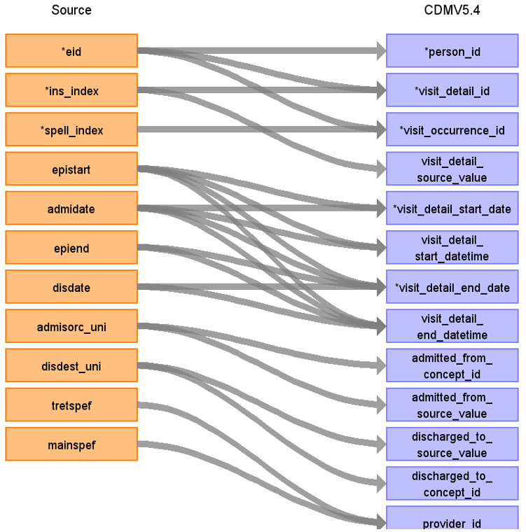

# CDM Table name: visit_detail (CDM v5.4)

## Reading from hesin

| Destination Field | Source field | Logic | Comment field |
| --- | --- | :---: | --- |
| visit_detail_id| | | Autogenerate|
| person_id| eid | | |
| visit_detail_concept_id| | [9201- Inpatient visit](https://athena.ohdsi.org/search-terms/terms/9201)| | |
| visit_detail_start_date | epistart, admidate | use the minimum of the first not null of (epistart, admidate) |    |
| visit_detail_start_datetime| epistart, admidate | |  |
| visit_detail_end_date | epiend, disdate, epistart, admidate| use the first not null of (epiend, disdate, epistart, admidate)|  |
| visit_detail_end_datetime | epiend, disdate, epistart, admidate| | |
| visit_detail_type_concept_id| | [32818- EHR administration record](https://athena.ohdsi.org/search-terms/terms/32818)| |
| provider_id |tretspef, mainspef | use the first not null of (tretspef,mainspef) to retrieve the provider_id from the provider table.|  |
| care_site_id| NULL | | |
| visit_detail_source_value| ins_index | | |
| visit_detail_source_concept_id| NULL | | |
| admitted_from_concept_id | admisorc_uni | use UKB_ADMISORC_STCM | UK BioBank source value starts with "265-" |
| admitted_from_source_value | admisorc_uni | |  |
| discharged_to_concept_id | disdest_uni| use UKB_DISDEST_STCM|  UK BioBank source value starts with "267-"|
| discharged_to_source_value | disdest_uni | |  |
| preceding_visit_detail_id|  | latest visit_detail_id before this one, for the patient if available  | |
| parent_visit_detail_id| NULL | | |
| visit_occurrence_id| eid, spell_index | | |

