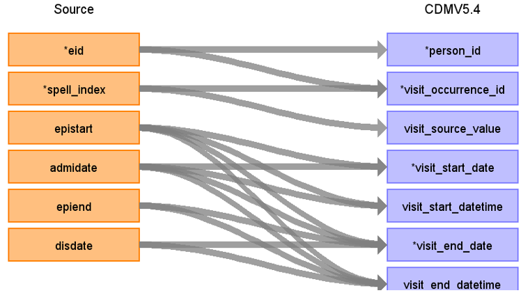

# CDM Table name: visit_occurrence (CDM v5.4)

## Reading from hesin

| Destination Field | Source field | Logic | Comment field |
| --- | --- | :---: | --- |
| visit_occurrence_id |  |   | Autogenerate | 
| person_id | eid |  |  |
| visit_concept_id |  | [9201- Inpatient visit](https://athena.ohdsi.org/search-terms/terms/9201)|  |
| visit_start_date | epistart, admidate | use the minimum of the first not null of (epistart, admidate) within the hospital spell|    |
| visit_start_datetime | epistart, admidate | |  |
| visit_end_date | epiend, disdate, epistart, admidate | use the maximum of the first not null of (epiend, disdate, epistart, admidate) within the hospital spell|  |
| visit_end_datetime | epiend, disdate, epistart, admidate | | |
| visit_type_concept_id |  |  [32818- EHR administration record](https://athena.ohdsi.org/search-terms/terms/32818)|  |
| provider_id |NULL| |  |
| care_site_id | NULL| |  |
| visit_source_value | spell_index |  | |
| visit_source_concept_id |NULL  |  |  |
| admitted_from_concept_id | NULL  | |  |
| admitted_from_source_value | NULL  | |  |
| discharged_to_concept_id | NULL | |  |
| discharged_to_source_value | NULL  |  |
| preceding_visit_occurrence_id |  | latest visit_occurrence_id before this one, for the patient if available |  |
