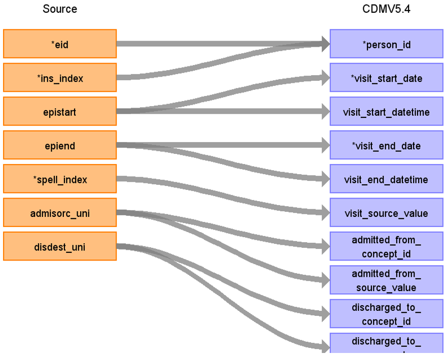

# CDM Table name: visit_occurrence (CDM v5.4)

## Reading from hesin

| Destination Field | Source field | Logic | Comment field |
| --- | --- | :---: | --- |
| visit_occurrence_id |  |   | Autogenerate | 
| person_id | eid |  |  |
| visit_concept_id |  | 9201 = Inpatient visit |  |
| visit_start_date | epistart, admidate, disdate| If epistart is null then use either admidate or disdate|    |
| visit_start_datetime | epistart, admidate, disdate | |  |
| visit_end_date | epiend | If epiend is null then use any of these if not null (disdate, epistart, admidate)|  |
| visit_end_datetime | epiend | | |
| visit_type_concept_id |  | 32818 = EHR administration record |  |
| provider_id |NULL| |  |
| care_site_id | NULL| |  |
| visit_source_value | spell_index |  | This will allow us to retrieve Visit_occurrence_id. |
| visit_source_concept_id |NULL  |  |  |
| admitted_from_concept_id | admisorc_uni |admisorc_uni will be mapped to Athena Standard Concept by using UKB_ADMISORC_STCM. |  |
| admitted_from_source_value | admisorc_uni | |  |
| discharged_to_concept_id | disdest_uni| disdest_uni will be mapped to Athena Standard Concept by using UKB_DISDEST_STCM.|  |
| discharged_to_source_value | |  |
| preceding_visit_occurrence_id |  | Using eid, ins_index look up the episode that occurs prior to this and put the visit_occurrence_id here. |  |
