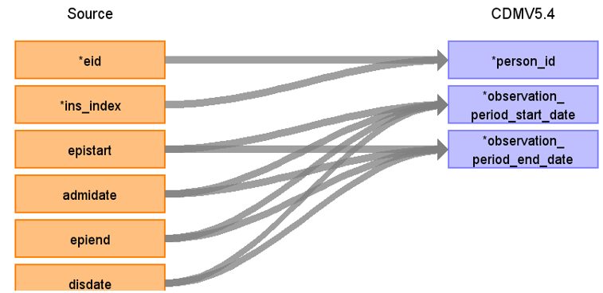

# CDM Table name: Observation_Period (CDM v5.4)

## Reading from HESIN

**Figure.1**

| Destination Field | Source field | Logic | Comment field |
| --- | --- | :---: | --- |
| observation_period_id |  | nextval('public.observation_period_seq') AS observation_period_id |  Autogenerate|
| person_id | eid | | |
| observation_period_start_date | admidate,epistart,disdate,epiend | Retrieve the earliest date among those dates like this: LEAST(MIN(admidate), MIN(epistart),MIN(disdate), MIN(epiend)) AS min_date| |
| observation_period_end_date |disdate,epiend,admidate,epistart | Retrieve the latest date among the date fields like this: GREATEST(MAX(disdate), MAX(epiend), MAX(admidate), MAX(epistart)) AS max_date | |
| period_type_concept_id | | 32880 | |
