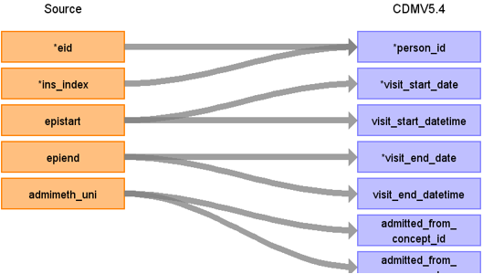

# CDM Table name: VISIT_OCCURRENCE (CDM v5.4)

## Reading from HESIN

**Figure.1**

| Destination Field | Source field | Logic | Comment field |
| --- | --- | :---: | --- |
| visit_occurrence_id |  |  nextval('public.sequence_vo') AS visit_occurrence_id | Autogenerate | 
| person_id | eid |  |  |
| visit_concept_id |  | 9201 = Inpatient visit |  |
| visit_start_date | admidate | COALESCE(admidate, MIN(epistart), disdate)|    |
| visit_start_datetime | admidate | COALESCE(admidate, MIN(epistart), disdate)|  |
| visit_end_date | disdate| COALESCE(disdate, MAX(epiend), admidate, MIN(epistart))|  |
| visit_end_datetime | disdate | COALESCE(disdate, MAX(epiend), admidate, MIN(epistart)) | |
| visit_type_concept_id |  | 32818 = EHR administration record |  |
| provider_id |NULL | |  |
| care_site_id | NULL| |  |
| visit_source_value | ins_index |  | This will allow us to retrieve Visit_occurrence_id. |
| visit_source_concept_id |NULL  |  |  |
| admitted_from_concept_id | admimeth_uni | use admimeth_uni to retrieve the target_concept_id from source_to_standard_vocab_map by doing a INNER JOIN to source_to_standard_vocab_map as t1 on CONCAT('264-',hesin.admimeth_uni) = t1.source_code AND t1.target_domain_id = 'visit' AND t1.source_vocabulary_id = “HESIN_ADMIMETH_STCM”. |  |
| admitted_from_source_value | admimeth_uni | use admimeth_uni to retrieve the source_code_description from source_to_standard_vocab_map by doing a INNER JOIN to source_to_standard_vocab_map as t1 on CONCAT('264-',hesin.admimeth_uni) = t1.source_code AND t1.target_domain_id = 'visit' AND t1.source_vocabulary_id = “HESIN_ADMIMETH_STCM”.|  |
| discharged_to_concept_id | NULL | |  |
| discharged_to_source_value | NULL | |  |
| preceding_visit_occurrence_id |  | Using eid+ins_index, look up the episode that occurs prior to this and put the visit_occurrence_id here. |  |
