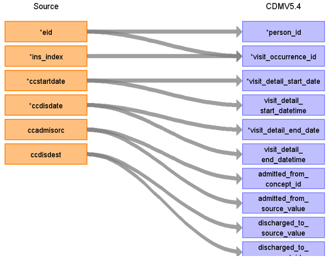
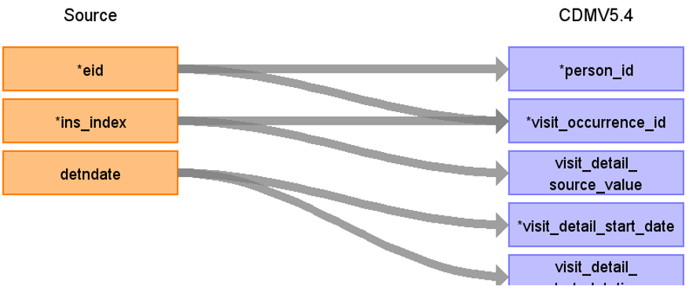

# CDM Table name: VISIT_DETAIL (CDM v5.4)

## Reading from hesin_critical

**Figure.1**

| Destination Field | Source field | Logic | Comment field |
| --- | --- | :---: | --- |
| visit_detail_id| | NEXTVAL('public.sequence_vd')| Autogenerate|
| person_id| eid | | |
| visit_detail_concept_id| | 9201 = Inpatient visit| |
| visit_detail_start_date| ccstartdate,ccdisdate | COALESCE(ccstartdate, ccdisdate)| |
| visit_detail_start_datetime| ccstartdate,ccdisdate  | COALESCE(ccstartdate, ccdisdate)| |
| visit_detail_end_date| ccdisdate,ccstartdate| COALESCE(ccdisdate,ccstartdate)| |
| visit_detail_end_datetime| ccdisdate,ccstartdate | COALESCE(ccdisdate,ccstartdate)| |
| visit_detail_type_concept_id| | 32818 = EHR administration record| |
| provider_id| NULL | | |
| care_site_id| NULL | | |
| visit_detail_source_value| ins_index | | |
| visit_detail_source_concept_id| NULL | | |
| admitted_from_concept_id| ccadmisorc | use ccadmisorc to retrieve the target_concept_id from source_to_standard_vocab_map by doing a LEFT JOIN to source_to_standard_vocab_map as t2 on CONCAT('7004-',hesin_critical.ccadmisorc) = t2.source_code AND t2.source_vocabulary_id = “HESIN_CCADMISORC_STCM”.| |
| admitted_from_source_value| ccadmisorc | use ccadmisorc to retrieve the source_code_description from source_to_standard_vocab_map by doing a LEFT JOIN to source_to_standard_vocab_map as t2 on CONCAT('7004-',hesin_critical.ccadmisorc) = t2.source_code AND t2.source_vocabulary_id = “HESIN_CCADMISORC_STCM”.| |
| discharged_to_source_value| NULL | | |
| discharged_to_concept_id| NULL | | |
| preceding_visit_detail_id| NULL | | |
| parent_visit_detail_id| NULL | | |
| visit_occurrence_id| ins_index,eid | |Use ins_index, eid to retrieve visit_occurrence_id from visit_occurrence |

## Reading from hesin_psych

**Figure.2**

| Destination Field | Source field | Logic | Comment field |
| --- | --- | :---: | --- |
| visit_detail_id| | NEXTVAL('public.sequence_vd')| Autogenerate|
| person_id| eid | | |
| visit_detail_concept_id| | 9201 = Inpatient visit | |
| visit_detail_start_date| detndate  | | |
| visit_detail_start_datetime| detndate  | | |
| visit_detail_end_date| NULL | | |
| visit_detail_end_datetime| NULL | | |
| visit_detail_type_concept_id| | 32818 = EHR administration record | |
| provider_id| NULL | | |
| care_site_id| NULL | | |
| visit_detail_source_value| ins_index  | | |
| visit_detail_source_concept_id| NULL | | |
| admitted_from_concept_id| NULL | | |
| admitted_from_source_value| NULL | | |
| discharged_to_source_value| NULL | | |
| discharged_to_concept_id| NULL | | |
| preceding_visit_detail_id| | | check for preceding_visit_detail_id by checking the max(visit_detail_id) for this patient using eid+ins_index|
| parent_visit_detail_id| NULL | | |
| visit_occurrence_id| eid, ins_index | | Use eid+ins_index to retrieve visit_occurrence_id from visit_occurrence | 