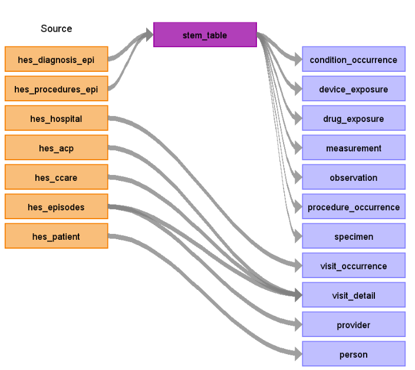

# Hospital Episode Statistics (HES) Admitted Patient Care (APC) ETL Documentation

These materials are meant to serve as documentation and reference for how the [HES APC](https://digital.nhs.uk/data-and-information/publications/statistical/hospital-admitted-patient-care-activity) dataset was converted to the [OMOP Common Data Model (CDM)](https://ohdsi.github.io/CommonDataModel/).

The image below (Figure.1) show a high-level diagram of how the native tables in the HESAPC database were mapped to the OMOP CDM. The main HESAPC tables converted include: (hes_patient, hes_diagnosis, hes_procedures_epi, hes_hospital, hes_acp and hes_episodes).

*HES APC source Data Mapping for CDM v5.3 & CDM v5.4*

**Figure.1**