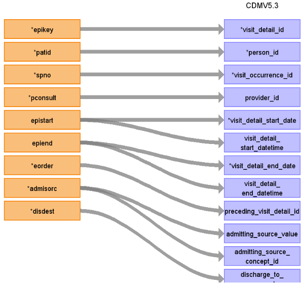
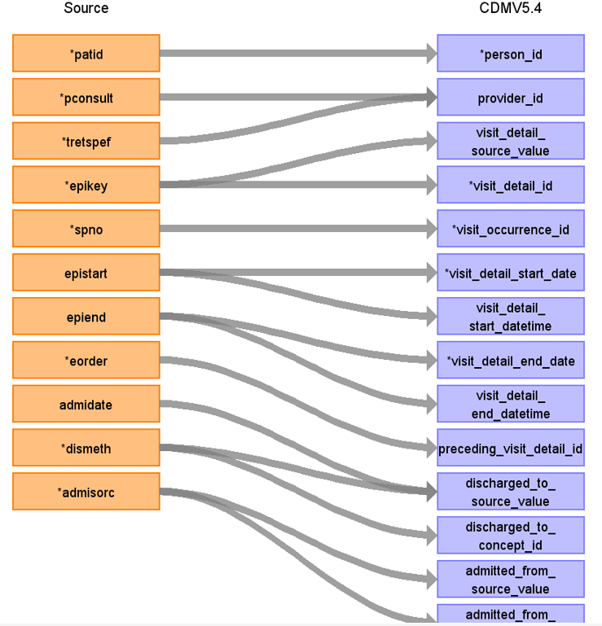
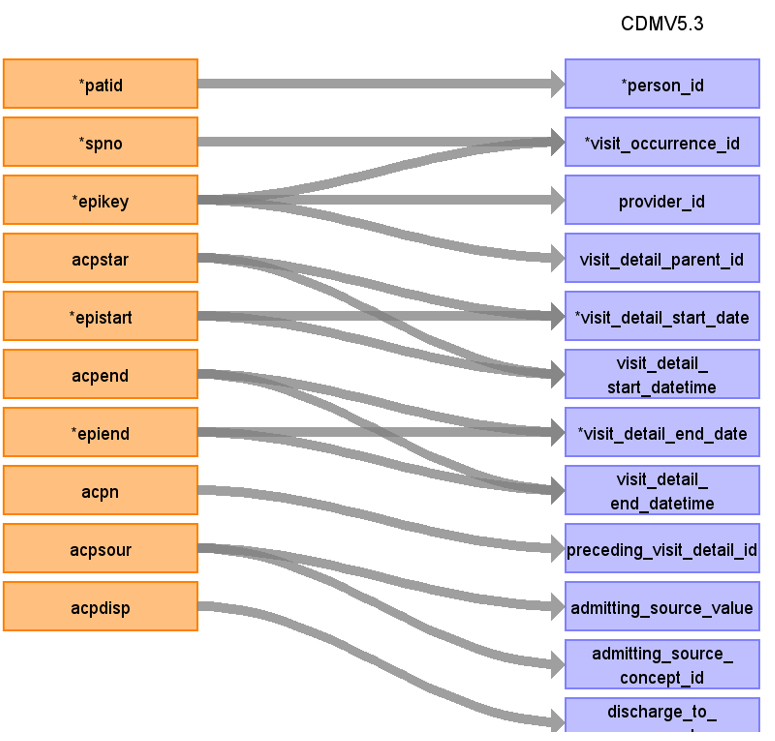
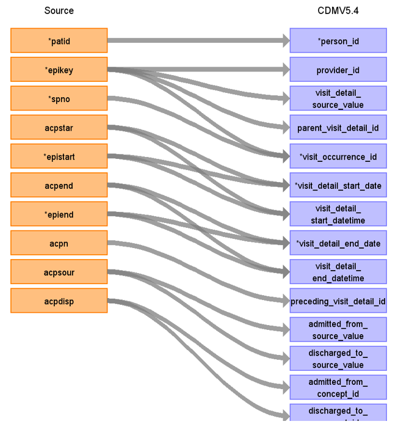
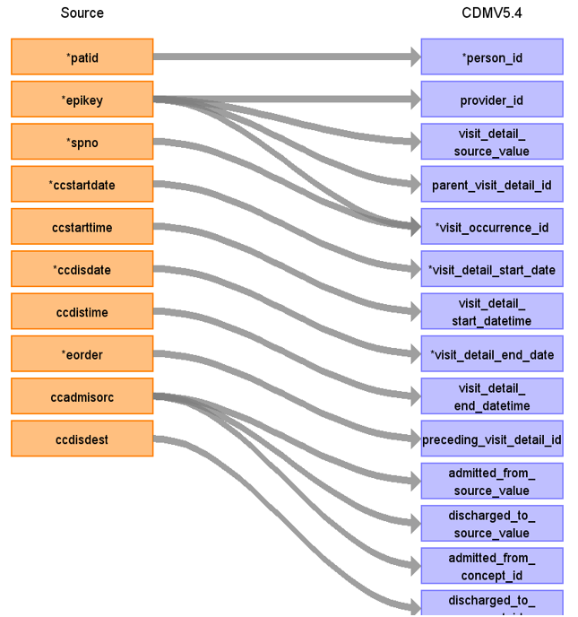

# CDM Table name: VISIT_DETAIL (CDM v5.3 / v5.4)

## Reading from hes_episodes, hes_acp, hes_ccare.

Take the carefully selected records from HES APC tables hes_episodes, hes_acp,and hes_ccare and map them as demonstrated in the figures below.

**Reading from hes_episodes to Visit_Detail CDM v5.3 table:**

**Figure.1**

| Destination Field | Source field | Logic | Comment field |
| --- | --- | --- | --- |
| visit_detail_id |  |  | Autogenerate: if table is empty, starts from MAX(public.visit_detail) + 1|
| person_id | patid |  |  |
| visit_detail_concept_id |  |  | 9201 = Inpatient visit |
| visit_detail_start_date | epistart | |  |
| visit_detail_start_datetime | epistart | |  |
| visit_detail_end_date | epiend | | |
| visit_detail_end_datetime | epiend | |  |
| visit_detail_type_concept_id |  | 32818 = "EHR administration record” |  |
| provider_id | pconsult,tretspef |  | Provider_id from PROVIDER using pconsult and tretspef |
| care_site_id | |  |  |
| visit_detail_source_value | epikey | | This will allow us to retrieve visit_detail_id using patid. |
| visit_detail_source_concept_id |  |  | 32828 |
| admitting_source_concept_id | admimeth |  | Definition to be added instead of number |
| admitting_source_value | admimeth |  | Check for OMOP codes from admimeth |
| discharge_to_concept_id | dismeth |  | Definition to be added instead of number |
| discharge_to_source_value | dismeth |  | Check for OMOP codes from dismeth |
| preceding_visit_detail_id | eorder | If eorder = 1 then 0 else check for preceding_visit_detail_id by using eorder for this patient using patid+epikey+spno. |  |
| visit_detail_parent_id |  |  |  |
| visit_occurrence_id |  |  | Use spno to retrieve visit_occurrence_id from visit_occurrence.visit_source_value |

**Reading from hes_episodes to Visit_Detail CDM v5.4 table:**

**Figure.2**

| Destination Field | Source field | Logic | Comment field |
| --- | --- | --- | --- |
| visit_detail_id |  |  | Autogenerate: if table is empty, starts from MAX(public.visit_detail) + 1|
| person_id | patid |  |  |
| visit_detail_concept_id |  |  | 9201 = Inpatient visit |
| visit_detail_start_date | epistart | |  |
| visit_detail_start_datetime | epistart | |  |
| visit_detail_end_date | epiend | | |
| visit_detail_end_datetime | epiend | |  |
| visit_detail_type_concept_id |  | 32818 = "EHR administration record” |  |
| provider_id | pconsult,tretspef |  | Provider_id from PROVIDER using pconsult and tretspef |
| care_site_id | |  |  |
| visit_detail_source_value | epikey | | This will allow us to retrieve visit_detail_id using patid. |
| visit_detail_source_concept_id |  |  | 32828 |
| admitting_from_source_concept_id | admimeth |  | Definition to be added instead of number |
| admitting_from_source_value | admimeth |  | Check for OMOP codes from admimeth |
| discharge_to_concept_id | dismeth |  | Definition to be added instead of number |
| discharge_to_source_value | dismeth |  | Check for OMOP codes from dismeth |
| preceding_visit_detail_id | eorder | If eorder = 1 then 0 else check for preceding_visit_detail_id by using eorder for this patient using patid+epikey+spno. |  |
| visit_detail_parent_id |  |  |  |
| visit_occurrence_id |  |  | Use spno to retrieve visit_occurrence_id from visit_occurrence.visit_source_value |

**Reading from hes_acp to Visit_Detail CDM v5.3 table:**

**Figure.3**

| Destination Field | Source field | Logic | Comment field |
| --- | --- | --- | --- |
| visit_detail_id |  |  | Autogenerate: if table is empty, starts from MAX(public.visit_detail) + 1|
| person_id | patid |  |  |
| visit_detail_concept_id |  |  | 32037 = Intensive care |
| visit_detail_start_date | acpstart,epistart | | If acpstart in not null then acpstar else epistart |
| visit_detail_start_datetime | acpstar, epistart | | If acpstart in not null then acpstar else epistart  |
| visit_detail_end_date | acpend, epiend | |If acpend is not null then acpend else epiend |
| visit_detail_end_datetime | acpend, epiend | | If acpend is not null then acpend else epiend  |
| visit_detail_type_concept_id |  | 32818 = "EHR administration record” |  |
| provider_id | hes_episodes.pconsult |  | Use patid+epikey to get it (only if efficient and provider populated) |
| care_site_id | |  |  |
| visit_detail_source_value | epikey | | This will allow to retrieve visit_details_id using patid If acpn = 1 then 0 else use acpn with patid+epikey and visit_detail_source_value = “Augmented care period (ACP)” to find the preceding_visit_detail_id  |
| visit_detail_source_concept_id |  |  |  |
| admitting_source_concept_id | acpsour |  | Definition to be added instead of number |
| admitting_source_value | acpsour |  | Check for OMOP codes from acpsour |
| discharge_to_concept_id | acpdisp |  | Definition to be added instead of number |
| discharge_to_source_value | acpdisp |  | Check for OMOP codes from acpdisp |
| preceding_visit_detail_id | | If acpn = 1 then 0 else use acpn with patid+epikey and visit_detail_source_value = “Augmented care period (ACP)” to find the preceding_visit_detail_id |  |
| visit_detail_parent_id |  |  | Use patid + epikey where visit_detail_source_value= “Visit episode” to get the visit_detail_parent_id  |
| visit_occurrence_id |  |  | Use spno to retrieve visit_occurrence_id from visit_occurrence.visit_source_value   |

**Reading from hes_acp to Visit_Detail CDM v5.4 table:**

**Figure.4**

| Destination Field | Source field | Logic | Comment field |
| --- | --- | --- | --- |
| visit_detail_id |  |  | Autogenerate: if table is empty, starts from MAX(public.visit_detail) + 1|
| person_id | patid |  |  |
| visit_detail_concept_id |  |  | 32037 = Intensive care |
| visit_detail_start_date | acpstart,epistart | | If acpstart in not null then acpstar else epistart |
| visit_detail_start_datetime | acpstar, epistart | | If acpstart in not null then acpstar else epistart  |
| visit_detail_end_date | acpend, epiend | |If acpend is not null then acpend else epiend |
| visit_detail_end_datetime | acpend, epiend | | If acpend is not null then acpend else epiend  |
| visit_detail_type_concept_id |  | 32818 = "EHR administration record” |  |
| provider_id | hes_episodes.pconsult |  | Use patid+epikey to get it (only if efficient and provider populated) |
| care_site_id | |  |  |
| visit_detail_source_value | epikey | | This will allow to retrieve visit_details_id using patid If acpn = 1 then 0 else use acpn with patid+epikey and visit_detail_source_value = “Augmented care period (ACP)” to find the preceding_visit_detail_id  |
| visit_detail_source_concept_id |  |  |  |
| admitting_from_source_concept_id | acpsour |  | Definition to be added instead of number |
| admitting_from_source_value | acpsour |  | Check for OMOP codes from acpsour |
| discharge_to_concept_id | acpdisp |  | Definition to be added instead of number |
| discharge_to_source_value | acpdisp |  | Check for OMOP codes from acpdisp |
| preceding_visit_detail_id | | If acpn = 1 then 0 else use acpn with patid+epikey and visit_detail_source_value = “Augmented care period (ACP)” to find the preceding_visit_detail_id |  |
| visit_detail_parent_id |  |  | Use patid + epikey where visit_detail_source_value= “Visit episode” to get the visit_detail_parent_id  |
| visit_occurrence_id |  |  | Use spno to retrieve visit_occurrence_id from visit_occurrence.visit_source_value   |

**Reading from hes_ccare to Visit_Detail CDM v5.3 table:**

**Figure.5**

| Destination Field | Source field | Logic | Comment field |
| --- | --- | --- | --- |
| visit_detail_id |  |  | Autogenerate: if table is empty, starts from MAX(public.visit_detail) + 1|
| person_id | patid |  |  |
| visit_detail_concept_id |  |  | 32037 = Intensive care |
| visit_detail_start_date | ccstartdate | | |
| visit_detail_start_datetime | ccstartdate | | |
| visit_detail_end_date | ccdisdate | | |
| visit_detail_end_datetime | ccdisdate | |  |
| visit_detail_type_concept_id |  | 32818 = "EHR administration record” |  |
| provider_id | hes_episodes.pconsult |  | Use patid+epikey to get it (only if efficient and provider populated) |
| care_site_id | |  |  |
| visit_detail_source_value | epikey | | This will allow to retrieve visit_details_id set to 0 at the end |
| visit_detail_source_concept_id |  |  |  |
| admitting_source_concept_id | ccadmisorc |  | Definition to be added instead of number |
| admitting_source_value | ccadmisorc |  | Check for OMOP codes from ccadmisorc |
| discharge_to_concept_id | ccdisdest |  | Definition to be added instead of number |
| discharge_to_source_value | ccdisdest |  | Check for OMOP codes from ccdisdest |
| preceding_visit_detail_id | | If eorder = 1 then 0 else use eorder with patid+epikey to find the preceding_visit_detail_id |  |
| visit_detail_parent_id |  |  | Use patid + epikey where visit_detail_source_value= “Visit episode” to get the visit_detail_parent_id  |
| visit_occurrence_id |  |  | Use spno to retrieve visit_occurrence_id from visit_occurrence.visit_source_value   |

**Reading from hes_ccare to Visit_Detail CDM v5.4 table:**

**Figure.6**

| Destination Field | Source field | Logic | Comment field |
| --- | --- | --- | --- |
| visit_detail_id |  |  | Autogenerate: if table is empty, starts from MAX(public.visit_detail) + 1|
| person_id | patid |  |  |
| visit_detail_concept_id |  |  | 32037 = Intensive care |
| visit_detail_start_date | ccstartdate | | |
| visit_detail_start_datetime | ccstartdate | | |
| visit_detail_end_date | ccdisdate | | |
| visit_detail_end_datetime | ccdisdate | |  |
| visit_detail_type_concept_id |  | 32818 = "EHR administration record” |  |
| provider_id | hes_episodes.pconsult |  | Use patid+epikey to get it (only if efficient and provider populated) |
| care_site_id | |  |  |
| visit_detail_source_value | epikey | | This will allow to retrieve visit_details_id set to 0 at the end |
| visit_detail_source_concept_id |  |  |  |
| admitting_from_source_concept_id | ccadmisorc |  | Definition to be added instead of number |
| admitting_from_source_value | ccadmisorc |  | Check for OMOP codes from ccadmisorc |
| discharge_to_concept_id | ccdisdest |  | Definition to be added instead of number |
| discharge_to_source_value | ccdisdest |  | Check for OMOP codes from ccdisdest |
| preceding_visit_detail_id | | If eorder = 1 then 0 else use eorder with patid+epikey to find the preceding_visit_detail_id |  |
| visit_detail_parent_id |  |  | Use patid + epikey where visit_detail_source_value= “Visit episode” to get the visit_detail_parent_id  |
| visit_occurrence_id |  |  | Use spno to retrieve visit_occurrence_id from visit_occurrence.visit_source_value   |