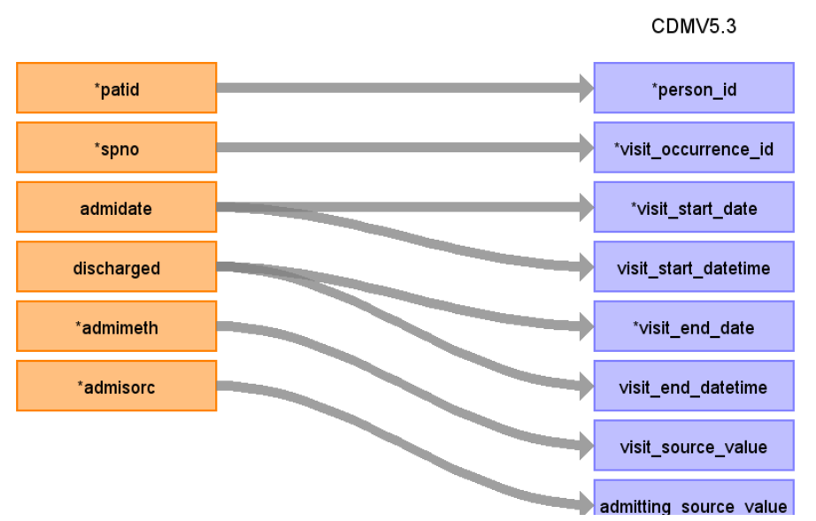
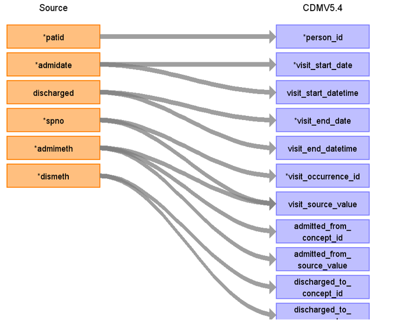

# CDM Table name: VISIT_OCCURRENCE (CDM v5.3 / v5.4)

**Reading from hes_hospital to Visit_Occurrence CDM v5.3 table:**

**Figure.1**

| Destination Field | Source field | Logic | Comment field |
| --- | --- | --- | --- |
| visit_occurrence_id |  |  | Autogenerate: if table is empty, start from MAX(public.visit_occurrence)+1  |
| person_id | patid |  |  |
| visit_concept_id |  |  | 9201 = Inpatient visit |
| visit_start_date | admidate |  If admidate is null, use the first epistart in episode, and if also these are null, use discharges| COALESCE(admidate, MIN(epistart), discharged) |
| visit_start_datetime | admidate  | If admidate is null, use the first epistart in episode, and if also these are null, use discharges | COALESCE(admidate, MIN(epistart), discharged) |
| visit_end_date | discharged | If discharged is null, use the last epiend in episode, and if also those are null, use admidate or the first of epistart | COALESCE(discharged, MAX(epiend), admidate, MIN(epistart)) |
| visit_end_datetime | discharged |If discharged is null, use the last epiend in episode, and if also those are null, use admidate or the first of epistart| COALESCE(discharged, MAX(epiend), admidate, MIN(epistart)) |
| visit_type_concept_id |  | 32818 = EHR administration record |  |
| provider_id | | |  |
| care_site_id | | |  |
| visit_source_value | spno | This will allow us to retrieve Visit_occurrence_id. |  |
| visit_source_concept_id |  |  |  |
| admitting_source_concept_id | admimeth |  | Check for OMOP codes from admimeth |
| admitting_source_value | admimeth |  | Definition to be added instead of number |
| discharge_to_concept_id | dismeth |  | Check for OMOP codes from dismeth |
| discharge_to_source_value | dismeth |  | Definition to be added instead of number |
| preceding_visit_occurrence_id |  | Using person_id, look up the hospitalisation that occurs prior to this and put the visit_occurrence_id here. |  |

**Reading from hes_hospital to Visit_Occurrence CDM v5.4 table:**

**Figure.2**

| Destination Field | Source field | Logic | Comment field |
| --- | --- | --- | --- |
| visit_occurrence_id |  |  | Autogenerate: if table is empty, start from MAX(public.visit_occurrence)+1  |
| person_id | patid |  |  |
| visit_concept_id |  |  | 9201 = Inpatient visit |
| visit_start_date | admidate |  If admidate is null, use the first epistart in episode, and if also these are null, use discharges| COALESCE(admidate, MIN(epistart), discharged) |
| visit_start_datetime | admidate  | If admidate is null, use the first epistart in episode, and if also these are null, use discharges | COALESCE(admidate, MIN(epistart), discharged) |
| visit_end_date | discharged | If discharged is null, use the last epiend in episode, and if also those are null, use admidate or the first of epistart | COALESCE(discharged, MAX(epiend), admidate, MIN(epistart)) |
| visit_end_datetime | discharged |If discharged is null, use the last epiend in episode, and if also those are null, use admidate or the first of epistart| COALESCE(discharged, MAX(epiend), admidate, MIN(epistart)) |
| visit_type_concept_id |  | 32818 = EHR administration record |  |
| provider_id | | |  |
| care_site_id | | |  |
| visit_source_value | spno | This will allow us to retrieve Visit_occurrence_id. |  |
| visit_source_concept_id |  |  |  |
| admitting_from_source_concept_id | admimeth |  | Check for OMOP codes from admimeth |
| admitting_from_source_value | admimeth |  | Definition to be added instead of number |
| discharge_to_concept_id | dismeth |  | Check for OMOP codes from dismeth |
| discharge_to_source_value | dismeth |  | Definition to be added instead of number |
| preceding_visit_occurrence_id |  | Using person_id, look up the hospitalisation that occurs prior to this and put the visit_occurrence_id here. |  |
